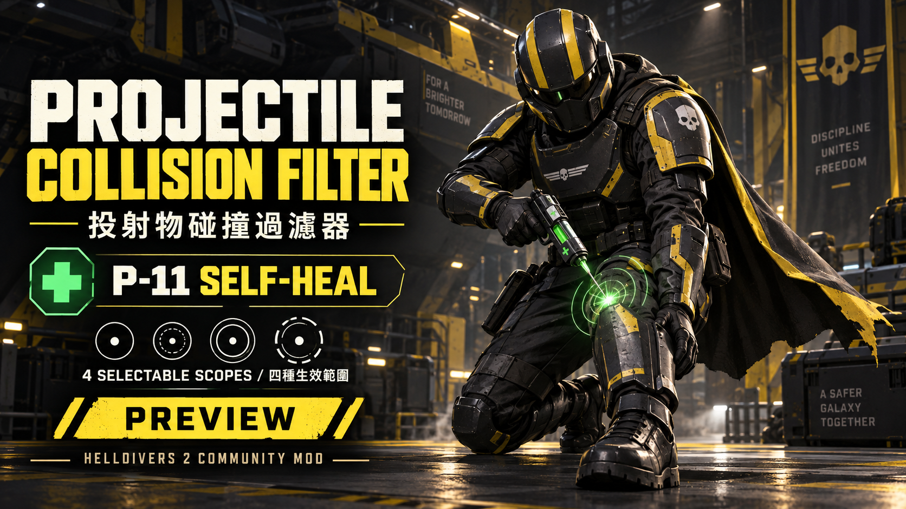

# Projectile Collision Filter — P-11 Self-Healing & Four Selectable Scopes

[繁體中文](README.md) · [Download v0.3.0-preview.8](https://github.com/cainiao524/HD2-Projectile-Collision-Filter/releases/tag/v0.3.0-preview.8) · [Install and switch](docs/SELECTABLE.md) · [Secondary coverage](docs/SECONDARIES.md)

Let darts fired from your P-11 hit your own character and trigger native healing. Aim and fire manually; choose one of four scopes inside a single Arsenal mod. Other eligible weapons retain their native effects, including possible self-damage.

**The user reports normal basic operation with all four preview.8 choices. This remains a prerelease.** The report is not a weapon-by-weapon test matrix, a full host/client test, or an FPS benchmark. Release packaging preserves the four Lua payloads and game resources from that tested package byte for byte.

## Bilingual Arsenal configuration

Labels and descriptions use English first, followed by Traditional Chinese. Select one option under **Effect Scope / 生效範圍**. P-11 is initially selected; Arsenal controls the overall enable switch.

| Arsenal label / 配置選項 | Scope / 範圍 |
|---|---|
| **P-11 Only / 僅治療手槍** | P-11 healing darts only; recommended and initially selected. / 僅治療飛鏢，推薦且首次預選。 |
| **All Sidearms / 手槍全部** | P-11 and supported sidearm projectiles; excludes shotguns and multi-projectile types. / P-11 與支援的副武器投射物，排除霰彈與多彈丸。 |
| **All Weapons (No Shotguns) / 全部武器不包括霰彈槍** | P-11 and supported weapon projectiles; excludes shotguns and multi-projectile types. / P-11 與支援的武器投射物，排除霰彈與多彈丸。 |
| **All Weapons (Including Shotguns) / 全部武器包括霰彈槍** | Includes shotgun/multi-projectile types. **WARNING: May cause severe performance impact.** / 包含霰彈與多彈丸；**警告：可能造成嚴重性能影響。** |

## Two release downloads

| Download | Use |
|---|---|
| [Projectile-Collision-Filter-v0.3.0-preview.8-build25480438.zip](https://github.com/cainiao524/HD2-Projectile-Collision-Filter/releases/download/v0.3.0-preview.8/Projectile-Collision-Filter-v0.3.0-preview.8-build25480438.zip) | **For players:** import into Arsenal and choose one scope. |
| [HD2-Projectile-Collision-Filter-Update-Toolkit-1.3.2-win-x64.zip](https://github.com/cainiao524/HD2-Projectile-Collision-Filter/releases/download/v0.3.0-preview.8/HD2-Projectile-Collision-Filter-Update-Toolkit-1.3.2-win-x64.zip) | Offline diagnostics after updates, complete matching source and maintenance/build guides. Extract separately; do not import into Arsenal. |

Only two ZIPs are manually attached. The four standalone alternatives are no longer published for this release. SHA-256 values appear in the [release body](https://github.com/cainiao524/HD2-Projectile-Collision-Filter/releases/tag/v0.3.0-preview.8); GitHub's automatic Source code links are not installable mods. Historical tags and assets remain available for rollback.

## Install, upgrade and switch

1. Close the game, let updates finish, and install a compatible [Bingus Shared Loader](https://github.com/CowboyBingus/BingusSharedLoader) separately.
2. Disable old selector packages, P-11 0.2.3 tests and other standalone self-hit mods in Arsenal, then purge the old deployment. **Enable only one self-hit mod at a time.**
3. Import the selectable ZIP above. Its GUID is preserved; replace the previous entry if Arsenal detects the same identity.
4. Choose one **Effect Scope / 生效範圍**, enable the mod, redeploy, then launch the game.
5. Close the game and redeploy when changing scopes, disabling or rolling back too.

Requires **Steam build 25480438 / EXE 1.8.46015.0 / Bingus Shared Loader v17, API 1, internal 16**. Unknown game/loader versions stop writes. Replacing hashes alone is not a port.

## How it works and what is supported

All four choices use one shared core and one deployed addon. It follows the native projectile allocation cursor, checks recent candidates and performs bounded retries instead of repeatedly traversing all 2,048 slots. Eligible projectiles must pass local ownership, source weapon, projectile identity, original-value and valid data-page checks. The guarded writer clears only source-collision exclusion bit `0x20`, checks dependencies again and reads the result back. Native collision and effects handle actual hits.

There is no native hook, executable patch or direct health, stamina, ammunition or damage-value write. Candidate processing still costs time; heavy traffic, queue limits, delayed initialization and collision timing can cause skipped projectiles. Zero overhead and success on every shot are not promised.

The earlier user report of **approximately 70 → 130 FPS with normal healing concerns P-11 0.2.3**, not a fixed performance gain for all four preview.8 choices.

- **All Sidearms** uses pinned secondary-slot reference data rather than the historical eight-ID list. Classification and working mechanism coverage remain separate claims.
- Dagger beam and Crisper spray are unsupported. Warrant, P33 and internal Hornet entity follow-up collision/effect paths remain unverified.
- Plasma/grenade-body hits do not establish every explosion or area effect. “All Weapons” covers supported native projectile paths.
- Choices 2 and 3 conservatively skip shotgun/multishot and out-of-reference types. Choice 4 **may cause severe performance impact**.

[Scopes and implementation](docs/VARIANTS.md) · [Performance notes](docs/PERFORMANCE.md) · [Verification](docs/VERIFICATION.md)

## Companion animation and teammate homing

For P-11, pair separately with [Raise Weapon: Aim at Yourself](https://ayakamods.com/mods/raise-weapon-aims-at-yourself.3946/), following its page to equip the Raise Weapon emote. A user also reported first-person foot shots; an actual dart hit on the character is still required.

The animation mod changes the pose. This mod changes eligible self-collision. Teammate homing remains a separate, unchanged original mod and is not bundled. This package does not aim or fire automatically. [P-11 usage](docs/SELF_HIT.md)

## Update diagnostics and development

Fully extract **Toolkit 1.3.2** and run `Collect-HD2-Update.cmd`; the Windows x64 collector needs no separate Python installation. Read the Chinese summary and repair handoff selected by `diagnostics/latest.json`. It gathers available on-disk identities, deployment resources, relevant existing logs and data files. It does not launch the game, read running processes, deploy or upload; automatic repair after every update is not guaranteed.

Complete source is already extracted under `Source/HD2-Projectile-Collision-Filter/`.

| Task | Entry |
|---|---|
| Install, switch, disable or roll back | [Player guide](docs/SELECTABLE.md) |
| Collect once after an update | [Offline update tool](docs/UPDATE_TOOL.md) |
| Develop, triage, port and hand over | [AGENTS.md](AGENTS.md) → [Agent runbook](docs/AGENT_GUIDE.md) → [Build and porting](docs/PORTING.md) |
| Validate and publish | [Verification](docs/VERIFICATION.md) · [Publishing](docs/PUBLISH.md) |
| Copy both AyakaMods pages, titles, BBCode and covers | [Publishing kit](docs/PAGE-PUBLISHING.md) |

The repository is now **HD2-Projectile-Collision-Filter**; historical versions retain their original names. Detailed maintenance guides are primarily Chinese; configuration, homepages and release copy are bilingual. Community mod, unaffiliated with Arrowhead Game Studios. OpenAI tools assisted development and documentation. [Sources](docs/THIRD_PARTY.md) · [License notice](LICENSE-NOTICE.md)
